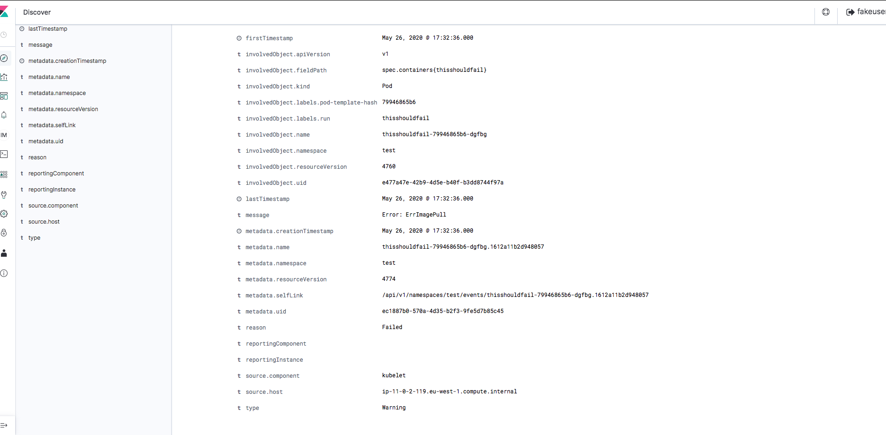

kubernetes event exporter
-----

Events are a type of logs in cluster that helps us debug or troubleshoot. Events are available when we run `kubectl describe pods` or `kubectl get events`

The problem is that by default they only last for 1 hour in order to conserve etcd. In EKS they are only available for 5 minutes.

In theory you can get all kubernetes events by running `kubeclt get events --watch` and pumping the results of that into a sink like elasticsearch. However we want to be able to filter only the events we need.

To export these `events` we will be using OpsGenie's `kubernetes-events-exporter` tool.

https://github.com/opsgenie/kubernetes-event-exporter/blob/master/README.md

Prerequisites
--------
* Running Kubernetes Cluster
* Running Elasticsearch cluster

For the purposes of demo we will be using AWS full managed services:

* kubernetes using AWS EKS
* elasticsearch using AWS Elasticsearch service

Setting up Elasticsearch
----------
manually create an elastic search cluster with username password.

Dont use aws specific features such as signed requests


TODO: Make this work with authentication this one does not have one at the moment
using https://www.terraform.io/docs/providers/aws/r/elasticsearch_domain.html

TODO: check if we can use cognito user pools instead of master user here

You might need to ugprade your aws cli

```
pip3 install awscli --upgrade
```

get the id of aws kms key called aws/es
```
ES_KMS_ID=$(aws kms list-aliases | jq -r '.Aliases[] | select(.AliasName=="alias/aws/es").TargetKeyId')
```

define username password
```
USERNAME=fakeuser
PASSWORD=Fakepassword1!
ES_DOMAIN=kubernetes-events-2
AWS_ACCOUNT=00000000000

```

```
aws es create-elasticsearch-domain \
  --region eu-west-1 \
  --domain-name $ES_DOMAIN \
  --domain-endpoint-options EnforceHTTPS=true,TLSSecurityPolicy=Policy-Min-TLS-1-2-2019-07 \
  --elasticsearch-version 7.4 \
  --elasticsearch-cluster-config InstanceType=r4.large.elasticsearch,InstanceCount=1 \
  --ebs-options EBSEnabled=true,VolumeType=standard,VolumeSize=10 \
  --node-to-node-encryption-options Enabled=true \
  --encryption-at-rest Enabled=true,KmsKeyId=$ES_KMS_ID \
  --advanced-security-options "{\"Enabled\":true,\"InternalUserDatabaseEnabled\":true,\"MasterUserOptions\": {\"MasterUserName\":\"$USERNAME\",\"MasterUserPassword\":\"$PASSWORD\"}}" \
  --access-policies "{\"Version\": \"2012-10-17\", \"Statement\": [ { \"Effect\": \"Allow\", \"Principal\": {\"AWS\": \"*\" }, \"Action\":\"es:*\", \"Resource\": \"arn:aws:es:us-west-1:$AWS_ACCOUNT:domain/$ES_DOMAIN/*\" } ] }"
```

### Testing setup

```bash
ES_ENDPOINT="https://search-kubernetes-events-fake-endpoints-123.eu-west-1.es.amazonaws.com"
AUTH=$(echo -ne fakeuser:Fakepassword1! | base64)
echo $AUTH

curl -XGET "$ES_ENDPOINT" -H "Authorization: Basic $AUTH"

curl -XPUT "$ES_ENDPOINT/movies/_doc/1?pretty" -H "Authorization: Basic $AUTH" -H 'Content-Type: application/json' -d '{ "title": "John Carter" }'

curl -XGET "$ES_ENDPOINT/movies/_doc/1?pretty" -H "Authorization: Basic $AUTH"
```

More ES queries:
* https://sysadmins.co.za/getting-started-with-aws-elasticsearch-service/

Setting up EKS
---------
```
brew tap weaveworks/tap
brew install weaveworks/tap/eksctl

git clone git@github.com:kenichi-shibata/cluster-test
eksctl create cluster -f dev-cluster-1.yaml
```

Setting up events-exporter
-----------

**change 01-configmap.yaml host to the ES_ENDPOINT before applying**

```
# update user name and password for the aws elasticsearch service
kubectl create ns monitoring

kubectl apply -f 00-roles.yaml
kubectl apply -f 01-configmap.yaml
kubectl apply -f 02-deployment.yaml
```

Check logs if authentication worked
```
kubectl logs deployment/event-exporter -n monitoring
```

Create a failed event
```
kubectl run -it --image=fakeimage/fakeimage123:123 thisshouldfail -n test
```

If you want to make the kubernetes fields searchable in elasticsearch you might need to index them like `kube-events-*`

If you want search try to reindex them `management -> index pattern -> new index pattern --> kube-events-* --> refresh icon`

Elasticsearch indexing
-------
* https://www.elastic.co/guide/en/kibana/current/managing-fields.html



